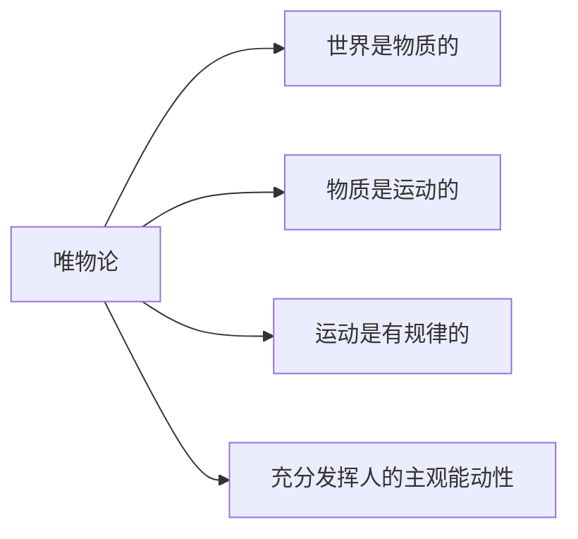

# 马克思主义基本原理课堂笔记

> [!NOTE]
>
> **来自 GitHub 项目 https://github.com/RickyZhu-420/Note-on-Basic-Principles-of-Marxism，可以提 issue 和获取本内容的 Markdown 源码**
>
> **本内容未完结，正在持续更新（每周二、周四 22:00 前后更新），请持续关注这个页面**

- 本内容由 <u>RickyZhu-420</u> 制作整理，指导教师：<u>Xiaohui Wan</u>，最近编辑于 :date: <u>2025/03/04</u>；

- 本内容需与 **高等教育出版社** 的 **马克思主义基本原理（2023年版）** `ISBN 978-7-04-059900-8` 配套使用；

- 本内容并非权威资料，并且**使用来自 OCR 识别的文本和 AI 生成的内容总结**，因此可能存在错别字和看似正确的错误。**始终参考课本并以课本原文为主**；

- 本内容的考频考点信息仅反映作者本人所在学校的考察要点，不代表考研考察内容，也不一定能满足任何人的要求；

- 本内容依据 CC0 1.0（知识共享署名零）许可证进行授权。**作者在此放弃该内容的版权，将其置于公有领域。任何人可以自由使用、复制、修改、分发、展示或表演该内容，无需获得许可或支付费用**。详情请参阅：https://creativecommons.org/publicdomain/zero/1.0/deed.zh-hans；

    

## 导论

### 一、什么是马克思主义

#### 马克思主义

- 是由马克思、恩格斯创立并为后继者所不断发展的科学理论体系；
- 是关于自然、社会和人类思维发展一般规律的学说；
- 是关于社会主义必然代替资本主义、最终实现共产主义的学说；
- 是关于无产阶级解放、全人类解放和每个人自由而全面发展的学说；
- 是无产阶级政党和社会主义国家的指导思想；
- 是指引人民创造美好生活的行动指南。

#### 马克思主义的三个基本组成部分

> [!IMPORTANT]
>
> **重要考察内容**

- 马克思主义哲学
- 马克思主义政治经济学
- 科学社会主义

#### 马克思主义基本原理

- 是对马克思主义立场观点方法的集中概括；
- 是马克思主义在其形成、发展和运用过程中经过实践反复检验而确立起来的具有普遍真理性的理论。

马克思主义的基本原理由以下三个方面展开：

#### 马克思主义的基本立场

> 简单来说就是人民立场

马克思主义的基本立场，是马克思主义观察、分析和解决问题的根本立足点和出发点。马克思主义以无产阶级的解放和全人类的解放为己任，以人的自由而全面发展为美好目标，以人民为中心，坚持一切为了人民，一切依靠人民，全心全意为人民谋幸福。

#### 马克思主义的基本观点

马克思主义的基本观点，是关于自然、社会和人类思维发展一般规律的科学认识，是对资本主义社会和社会主义社会发展规律的科学认识，是对人类思想成果和社会实践经验的科学总结。

#### 马克思主义的基本方法

马克思主义的基本方法，是建立在辩证唯物主义和历史唯物主义世界观和方法论的基础上，指导我们正确认识世界和改造世界的思想方法和工作方法。

### 二、马克思主义的创立与发展

- 马克思主义产生于 19 世纪 40 年代，创始人是马克思和恩格斯。

#### 社会背景

- 资本主义生产方式飞速发展

- 社会两级分化，工人极端困苦

- 周期性经济危机频发

#### 19 世纪 30-40 年代西欧三大工人运动

1. 1831 年、1834 年，法国里昂工人起义
2. 1836 年，英国宪章运动
3. 1844 年，德国西里西亚纺织工人起义

三大工人运动的兴起标志着现代无产阶级作为独立的政治力量登上了历史舞台。

#### 马克思主义的理论来源

- 德国古典哲学
- 英国古典政治经济学
- 英法空想社会主义

#### 空想社会主义代表人物与思想

> [!CAUTION]
>
> **此处使用 AI 总结**

**昂利·圣西门**

- **思想主张**：圣西门是空想社会主义的先驱之一，他主张建立一个“实业制度”，由实业家和科学家管理社会，以实现社会的和谐与进步。
- **贡献**：他强调科学技术在社会发展中的重要作用，提出“实业救国”的理念，认为社会的进步依赖于工业和科学的发展。

**沙尔·傅里叶**

- **思想主张**：傅里叶批判了资本主义社会的种种弊端，主张建立“和谐社会”，并设计了一种名为“法郎吉”的社会组织形式。
- **贡献**：他提出了对未来社会的具体构想，强调社会成员之间的合作与和谐，反对资本主义的剥削和竞争。

**罗伯特·欧文**

- **思想主张**：欧文是英国著名的空想社会主义者，他主张通过改革社会制度来消除贫困和不平等，提出了“新和谐公社”的实验。
- **贡献**：欧文在实践中尝试建立理想的社会模式，如在苏格兰的新拉纳克工厂进行社会改革实验，试图改善工人生活条件。

空想社会主义抨击了资本主义的现象，为马克思主义提供了重要的理论借鉴。

#### 马克思主义的自然科学前提

- 细胞学说
- 能量守恒定律
- 生物进化论

#### 马克思主义的发展

##### 第一阶段：19 世纪 40 年代中期至 19 世纪末，马克思主义系统化的发展时期

- 1848 年《共产党宣言》的发表，标志着马克思主义的公开问世。

##### 第二阶段：20 世纪初，列宁主义和毛泽东思想丰富和发展了马克思主义

- 资本主义发展到垄断阶段，列宁将马克思主义基本原理与俄国具体实际相结合，提出「帝国主义论」等。
- 在中国，马克思主义基本原理与中国革命实际的结合，形成了毛泽东思想。

##### 第三阶段：20 世纪中期末，马克思主义在中国的发展（1921 年至今）

- 毛泽东思想
- 邓小平理论
- 「三个代表」重要思想
- 科学发展观
- 习近平新时代中国特色社会主义思想

#### 马克思主义的基本特征

> [!NOTE]
>
> **必考内容**

**马克思主义具有鲜明的科学性、人民性、实践性、发展性**

- **科学性**：
    - 马克思主义是对自然、社会和人类思维本质和规律的客观反映。
    - 理论来源的科学性
    - 能够揭示真正的规律
- **人民性**：
    - 人民性是马克思主义的本质属性，人民至上是马克思主义的政治立场
- **实践性**：
    - 马克思主义是从实践中来，到实践中去，在实践中接受检验，并随实践而不断发展的学说
- **发展性**：
    - 马克思主义不是固步自封的体系，而是随着社会发展和时代进步，通过实践与时俱进、不断创新的开放理论

#### 马克思主义的当代价值

> [!NOTE]
>
> **必考内容**

- 观察当代世界变化的认识工具
- 指引当代中国发展的行动指南
- 引领人类社会进步的科学真理

---

## 第一章 世界的物质性及发展规律

### 一、物质及其存在方式

#### 哲学、世界观与方法论

> [!CAUTION]
>
> **此处使用 AI 总结**

- 世界观是人们对世界的总体看法和根本观点。
- 方法论是人们认识和改造世界所遵循的根本方法的学说和理论体系。

- 哲学是对世界、人类、思维和存在等问题进行系统化、理论化的思考和研究。它不仅关注“是什么”的问题，还追问“为什么”“应如何”等问题。哲学试图通过逻辑推理、概念分析和批判性思维，寻找普遍的真理和规律。

#### 世界观与物质性

- 世界观决定方法论，方法论体现世界观。
- 哲学是世界观和方法论的统一。

#### 哲学的基本问题

- 哲学的基本问题有且仅有一个，就是**思维和存在的关系问题**。

- 哲学问题的第一方面：思维是本源还是存在是本源？**（本体论）**

    `思维是本源?唯心主义:唯物主义`

- 哲学问题的第二方面：思维和存在是否具有同一性？**（认识论）**

    `思维可以认识存在吗?可知论:不可知论`

#### 哲学的基本派别：唯物主义、唯心主义

> 两种主义并非对错之分，只有科学与否等的区别。它们是人类对世界本质和认识路径的不同理解。

- 划分区别：
    - 对思维和存在何者为本源问题的不同回答。

- 唯物主义根本观点：
    - **物质是世界的本源，意识是物质的产物**。
- 唯心主义根本观点：
    - 意识是世界的本源，物质依赖于意识。

#### 唯物主义派别

##### 古代朴素唯物主义

- 世界的存在是物质的。
- 优点：包含了朴素辩证论。缺点：是将复杂问题过度简单化。

##### 近代形而上学唯物主义

- 世界的本原是原子。
- 优点：具有科学性。缺点：具有机械性、片面性，在历史观上是唯心主义的。

#### 唯心主义派别

##### 主观唯心主义

- 人的主观精神是一切事物存在的根源与基础。
- 夸大了人的主观能动性。

##### 客观唯心主义

- 人的客观精神是一切事物存在的根源与基础。
- 有神秘主义色彩。

##### 什么是「人的主/客观精神」？

> [!CAUTION]
>
> **此处使用 AI 总结**

人的主观精神是指个体的内在意识、思维、情感、意志、观念等心理活动和精神状态。它是个人的、主观的、属于个体自身的意识内容。

人的客观精神是指某种超越个体主观意识的、具有普遍性和客观性的精神力量。它被认为是一种独立于个人意识之外的“绝对精神”“理念”“上帝”等抽象概念。

#### 唯物论

> [!CAUTION]
>
> **此处使用 AI 总结**

##### 哲学的物质范畴

物质的定义：**物质是不依赖于人类的意识而存在，并能为人类的意识所反映的客观实在**。

- 前半句与唯心主义划清界限，后半句与不可知论划清界限。

    > 恩格斯：「**世界的真正的统一性在于它的物质性**。」

- 此处的「反映」一词易误为「~~反应~~」，「客观实在」一词易误为「~~客观存在~~」。

物质的唯一特性是**客观实在**。

- **客观「实在」**与**客观「存在」**的区别：

    | **概念**       | **客观存在**                               | **客观实在**                         |
    | -------------- | ------------------------------------------ | ------------------------------------ |
    | **含义**       | 一切实际存在的事物和现象，包括物质和意识。 | 物质的唯一特性，是物质的共性。       |
    | **涵盖范围**   | 包括物质现象和意识现象                     | 仅指物质的属性，不包括意识           |
    | **本质属性**   | **独立性**：独立于人的意识之外             | **物质性**：是物质的共性，区别于意识 |
    | **是否可感知** | 可感知（通过感觉或科学仪器）               | 抽象的，不可直接感知，但通过物质体现 |
    | **哲学地位**   | 描述一切实际存在的事物                     | 描述物质的本质属性，是唯物主义的核心 |
    | **举例**       | 自然现象、社会现象、意识现象               | 石头、水、空气等物质的共性           |

所以，此处描述物质的特征必须使用「客观实在」，因为「客观存在」同时包括意识存在的范畴。

##### 世界是物质的

- 自然界是物质的
- 人类社会是物质的
- 意识依赖于物质

##### 物质是运动的

- 运动是**物质**的运动
    - 物质是运动的载体
    - 离开了物质谈运动导致**唯心主义**
- 物质是**运动**的物质
    - 运动是**物质固有的根本属性和存在方式**
    - 任何物质都离不开运动，没有片面静止的物质
    - 离开运动谈物质导致**形而上学**
- 绝对运动和相对静止
    - 运动是绝对的、无条件的、永恒的
    - 静止是相对的、有条件的、暂时的
    - 静止是特殊的运动、不显著的运动

只承认运动而否认静止，会陷入相对主义（诡辩论）。只承认静止而否认运动，会陷入形而上学。

唯物论坚持运动和相对静止的有机统一。

##### 运动是有规律的

##### 充分发挥人的主观唯物性
